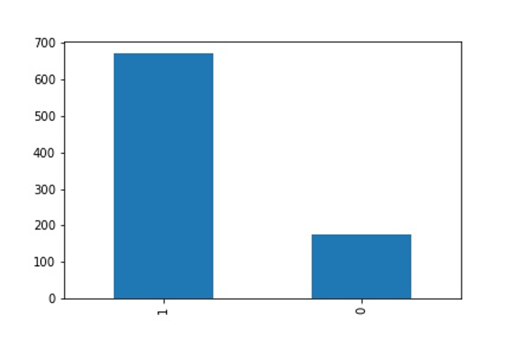
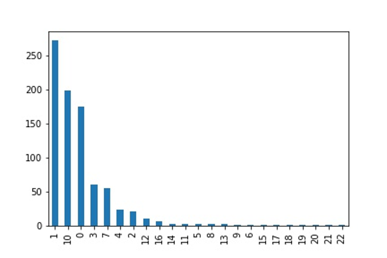
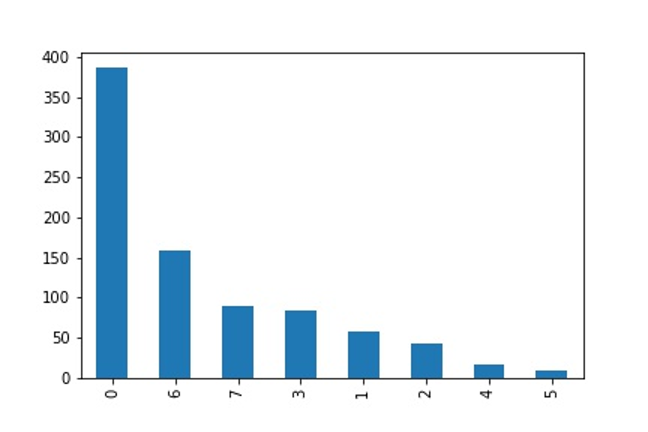
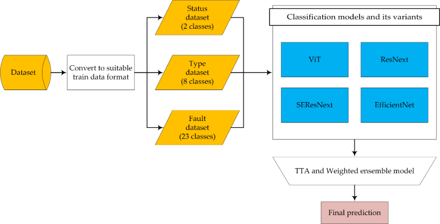
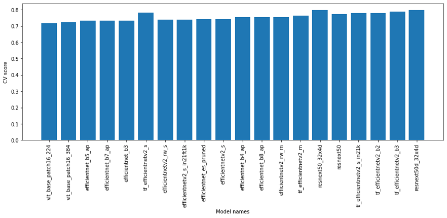
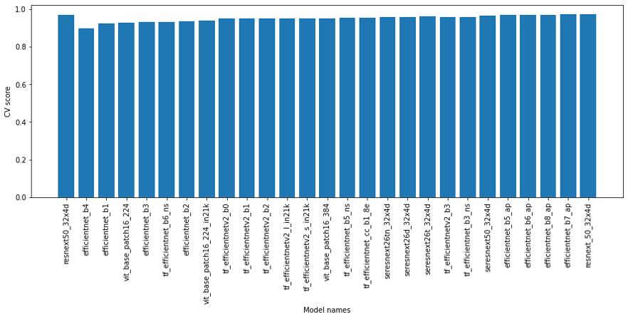

# 21 AICHAMP
- 한국전력 과제명 : 인공지능 활용 광학진단 사진 위해개소 자동적출
- 전신주의 이미지를 보고 이상판단(Status), 고장부위(Type), 고장원인(Fault)을 판단하는 모델 생성
- 최종 정확도 약 95%로 우승
- 딥러닝 라이브러리 PyTorch 사용
- 프로그래밍 언어 Python 사용

## 전처리(Pre-Processing)
- 이미지 데이터가 약 200개로 확인 결과 Data Cleansing을 적용하진 않음
- train_output.csv파일에서 Class를 숫자로 변환.
- 모델 훈련 및 추론을 위해 k = 5인 k-fold를 사용

## 탐색(EDA)
Training 데이터의 분포
- Status

- Fault

- Type

이를 통해 데이터의 불균형이 존재함을 알게 됨

## 변수 선택 및 모델 구축 (Feature Engineering & Initial Modeling)

- Status, Fault, Type을 3개의 모델로 분할한 뒤 병합하기로 함.
- 초기 모델링에서는 CrossEntropy 손실이 있는 세가지 모델 모두에 Resnext50_32x4d를 사용

## 모델 학습 및 검증 (Model Tuning & Evaluation)
-  데이터의 불균형이 큼. 특히 Fault 모델의 경우 심함
-  특수한 손실 함수 시도 (Label Smoothing, Focal Loss, Focal Cosine Loss, Symmetric cross-entropy loss, Bi tempered loss, Taylor cross-entropy loss)
-  다양한 Training Scheduler 시도
-  다양한 아키텍쳐로 모델 학습 시도 (ResNext, EfficientNetv2, ViT, SeResNext)

## 결과(Result)
- TTA 적용
- Augmentation (CLAHE, Hflips, Vflips, Normalize)
- Class 별 높은 LB 달성하는 모델 적용 및 Asemble
- 앙상블 모델 (0.954054)로 1순위 달성
- 각 Class에 대한 모델 성능

